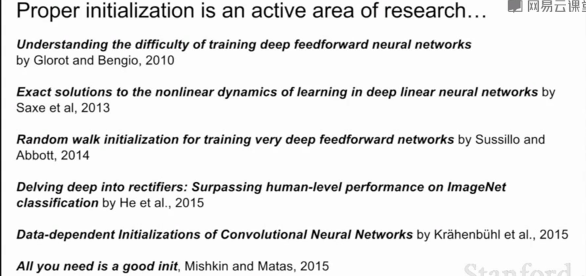
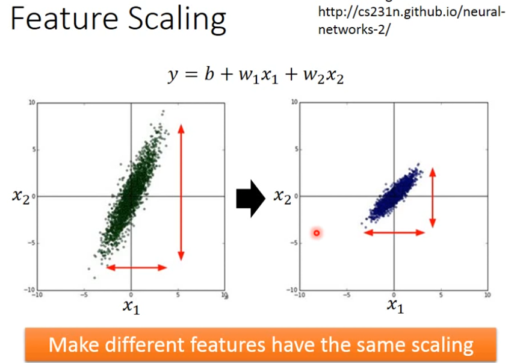
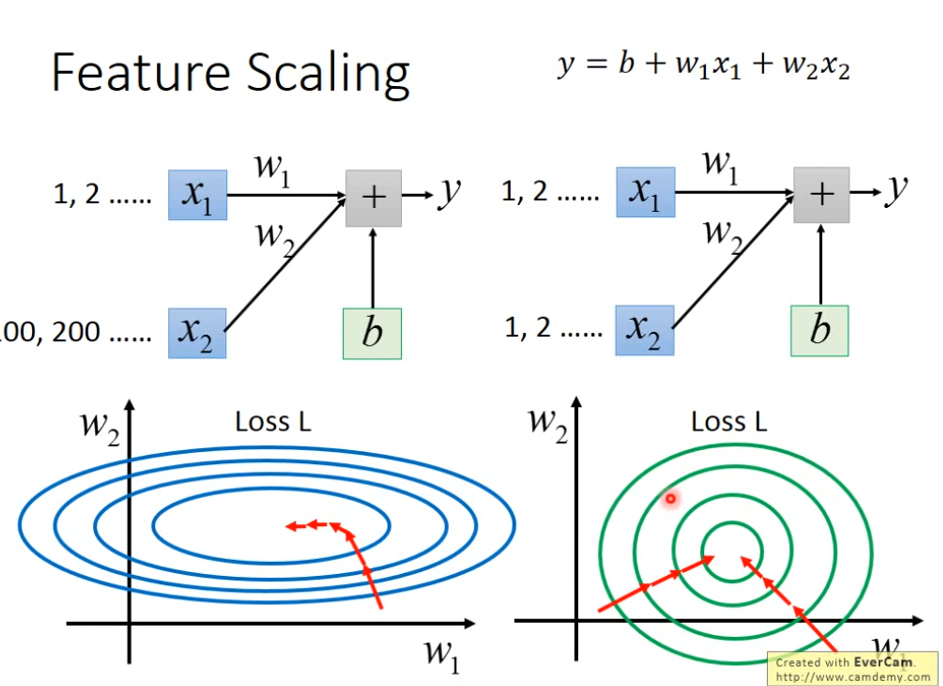

# Weight Initialization

- What will happen if all weights are initialized to the same number?
- What will happen if all weights are initialized to big numbers?
- What is xavier weight initialization?

# Normalizing Inputs

If data points of different dimentions are not in near scale, their weight will have different influence on loss, so the loss graph looks like below:

And this will make training process slower.

# Optimization

## Adam

[Adam: A Method for Stochastic Opti- mization](http://arxiv.org/abs/1412.6980)