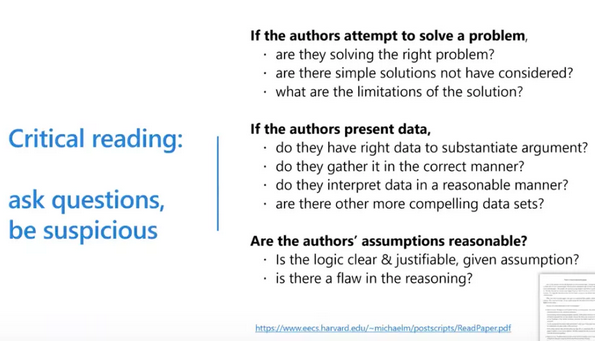

# 施一公读论文的建议

从1998年在普林斯顿大学任职到现在清华大学做教授，我总是告诉自己实验室的所有年轻人（包括本科生、硕士生、博士生、博士后）下面这几点读科研论文的体会，也希望我的学生跟我学：

1. 请每位学生每周关注《科学》和《自然》。（生命科学界的学生还应该留心《细胞》）。如果时间有限，每周花一个小时读读这两种周刊里的文章标题以及与自己研究领域相关的科研论文的abstract,即可！这样做可以保证一个学生基本上能够跟踪本领域最重要的发现和进展，同时开阔视野，大概知道其它领域的动态。
2. 在时间充足的情况下，可以细读《科学》和《自然》里的新闻及科研论文。如果该科研论文有“News & Views”或“Perspectives”来介绍，请先读这些文章，这类导读的文章会提炼问题，就好比是老师事先给学生讲解一番论文的来龙去脉，对学生阅读原始论文有很大帮助。
3. 在读具体的科研论文时，最重要的是了解文章的主线逻辑。文章中的所有Figures都是按照这个主线逻辑展开描述的。所以，我一般先读“introduction”部分，然后很快地看一遍Figures。大概知道这条主线之后，才一字一句地去读“results”和“discussion”。
4. 当遇到一些实验或结果分析很晦涩难懂时，不必花太多时间深究，而力求一气把文章读完。也许你的问题在后面的内容中自然就有解答。这与听学术讲座非常相似！你如果想每个细节都听懂，留心每一个技术细节，那你听学术讲座不仅会很累，而且也许会为了深究一个小技术环节而影响了对整个讲座逻辑推理及核心结论的理解。
5. 对个别重要的文章和自己领域内的科研论文，应该精读。对与自己课题相关的每一篇论文则必须字斟句酌地读。这些论文，不仅要完全读懂，理解每一个实验的细节、分析、结论，还必须联想到这些实验和结论对自己的课题的影响和启发，提出自己的观点。
6. 科学论文的阅读水平是循序渐进的。每个人开始都会很吃力，所以你有这种感觉不要气馁。坚持很重要，你一定会渐入佳境。当你有问题时或有绝妙分析时，应该与师兄师姐或找导师讨论。
7. 科研训练的一个重要组成部分就是科研论文的阅读。每一个博士生必须经过严格的科研论文阅读的训练。除了你自己的习惯性阅读外，你应该在研究生阶段选修以阅读分析专业文献为主的一至两门课，在实验室内也要有定期的科研论文讨论（Journal Club）。如果你的实验室还没有这种讨论，你们学生可以自发地组织起来。
8. 前面几条都是讨论如何提高科研论文的阅读能力，但是一旦入了门，就要学会critical     reading。不要迷信已发表的论文，哪怕是发表在非常好的期刊上。要时刻提醒自己：该论文逻辑是否严谨，数据是否可靠，实验证据是否支持结论，你是否能想出更好的实验，你是否可以在此论文的基础上提出新的重要问题？等等。

# From [WeChat Official Account](https://mp.weixin.qq.com/s/2iwK369LT3qgSypeSWWdCg) and [How to read a research paper]( https://www.eecs.harvard.edu/~michaelm/postscripts/ReadPaper.pdf)

香侬理论只是概括了阅读与写作的一部分，**真实的阅读往往超越了传统的“传输-压缩”框架**，它更多的是一个反复的理解过程。在这个过程中，读者不断地揣测作者的意图，并将之解构成能够理解的片段，随后这些片段被构建到读者脑中的认知模型里。所以，阅读等同于理解，不同层次的阅读对应不同层次的理解——**深度阅读导致深度理解**，浅显的阅读对应的必然是浅显的理解。**不同需求应该对应不同的阅读层次**，你可能需要快速浏览，可能需要仔细阅读，如果你的导师需要你复现论文中的细节，那么你就需要非常深入地研读。

无论是计算机视觉领域的文章还是泛计算机类的文章，一般来讲，都可以归为以下几类：**提出问题型论文、解决问题型论文、阐述和调查型论文、总结型论文**。

### 速读

标题 -> 摘要 -> 引言的summary -> 文章的图表及其描述 -> 模型方法

### 批判性阅读

以批判性阅读开始，带着质疑的心态问问题。

一旦进入仔细阅读的状态，要在读论文之前对自己说：这篇论文可能有问题，我要找出来。这就是批判性阅读。

如果作者论文中声称解决了一个问题，那么你就要在心里问自己：

- 论文是否正确、真正地解决了问题？
- 作者论文中所用方法是否有局限性？
- 如果所读的论文没有解决问题，那么我能解决么？
- 我能采用比论文中更简单的方法解决么？

### 创造性阅读

创造性的阅读需要把你所读的论文**和其他相关的论文建立联系**，从而产生一些新的想法，这些想法可以支撑你进行三个月到五个月的研究。如果读到了非常好的文章，不妨写一篇半页到一页左右的review。最好做一个口头展示，这样你会发现，只有把东西写下来或者说出来才能真正深刻理解。

要问自己：

- 在我所读的论文中，有哪些好的idea？（一般文章中只有一个idea，好的文章中可能有两个idea，最了不起的文章可以有2.5个idea。）
- 搞清楚作者的idea以后你要思考，作者有哪些点还没有想到？可以怎么改进？
- 如果我现在做这项研究，我能做的新事情是什么？

Ask Myself:

