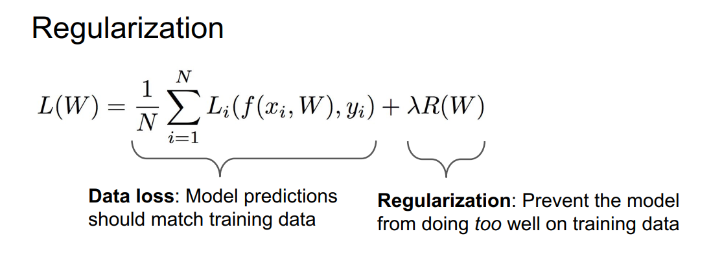
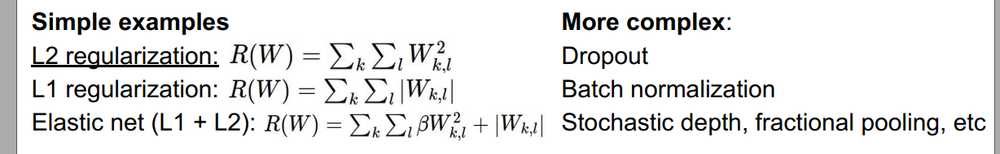
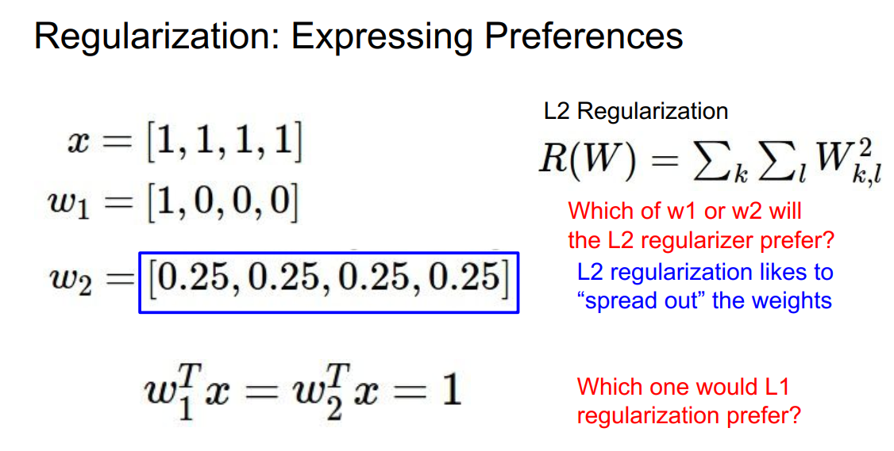
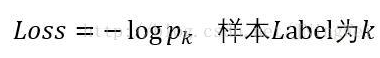
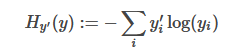

# cs231n

## Lecture 3

### Multiclass SVM loss  

calculate for per class.

Compared with $S_{y_{i}}$ , if $S_{j}$ is smaller over the margin (here is 1),  then the loss is 0. S means score for every class. i means classes of label.

### Regularization

Regularization pushes against fitting the data too well so we don’t fit noise in the data. There are some regularization methods.

		

### Why regularize?

- Express preferences over weights
- Make the model simple so it works on test data
- Improve optimization by adding curvature  

## Softmax Classifier

- direct error

- cross-entropy

