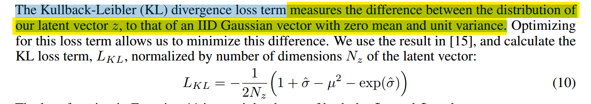

# A Neural Representation of Sketch Drawings

## Main Task and Contribution

- Train machines to draw and generalize abstract concepts in a manner similar to humans. There are two classes, conditional and unconditional generation.

- They  outline a framework for both unconditional and conditional generation of vector images  composed of a sequence of lines.

- They develop a training procedure unique to vector images to make the training more robust.

## Model Architecture

### Encoder

### Autoregressive Decoder

#### Input

h, s, z

h is the state of the cell before

s is the output of the cell before

z is the latent vector from decoder

#### Output

y, s, h

y is a (6M+3)-dimension vector, **6M for the parameters of M GMM** and 3 for the 3-dimension pen state vector. Adjusting parameters to make M GMM model fit data better. 

s is the (x, y, q1, q2, q3), x and y are sampled from the GMM, q1, q2 and q3 are from softmax. The output at each time step are the parameters for a probability distribution of the next data point Si.

h is the real output of network.

### Loss

#### Part 1

While using the M GMM(got from network) to model the training data, we want our M GMM could  explain the data better, so we need to max this Ls. This loss is used for both conditional and unconditional generation.

Besides this, we also need to compare the three pen state terms:

Combine them:

#### Part 2

***Kullback-Leibler divergence loss,***

## Other methods

- temperature parameter T: it is used to add randomness to parameters of GMM and categorical distributions.

## Experiments

## Questions

- Why do they measure the difference between latent vector z and IID Gaussian vector?
- Why do they train the parameters of GMM and then sample from GMM to get sketch points, instead of generating sketch points directly using network?   
- About the loss function, for the while model(encoder and decoder), to backward the KL loss will  update parameters of encoder, will it update parameters of both encoder and decoder when to backward the reconstruction loss? 
- Why  do they add sample from N(0,1) to vector h?

## Ideal

- Can we use cnn-rnn architecture to encode sketch and then decode to draw?

# Multi-Graph Transformer for Free-Hand Sketch Recognition

## Main task and Contribution

- Model sketches as sparsely connected graphs.
- Give a novel transformer architecture which can handle arbitrary graphs.

## Research before It

- CNNs or RNNs

## Why does the author do like this?

- Learning representations of sketches from multiple graphs which simultaneously capture global and local geometric stroke structures, as well as temporal information. 

- We assume that sketches are sets of curves Multi-Graph Transformer for Free-Hand Sketch Recognition and strokes, which are discretized by a set of points representing the graph nodes. This view offers high flexibility to encode different sketch geometric properties as we can decide different connectivity structures between the node points.

## Model Architecture

#### Input Embedding

- coordinate: 

  ​	from B x S x 2 -> B x S x d (linear layer)

- flag and position: 

  ​	from B x S x 2 -> B x S x (2 x d) (dictionary)

#### Stacking L Multi-Graph Transformer (MGT) layers

- Graph Attention Layer 

  

- Multi-Head Attention Layer

- Multi-Graph Multi-Head Attention Layer

- Multi-Graph Transformer Layer

where h is the embedding result of sketch stroke points. MHA and FF sub-layer has residual connections. Here, h is the input embedding after stacking MGMHA, eg. after stacking l-1 MGMHA we get the l th h.

- Graph Embedding and Classification

h is from MGT layers. After that, a MLP is used to classify h. The dimension is from B x S x d to B x d. Then after softmax they become B x N (number of classes).

## Other Methods

### Representation of Sketch Points

- spatial positional information (x, y)
- pen state of point (1, 2, 3)
- temporal information of point (0, 1, ..., S-1)

### Sketch-Specific Graphs

- K-hop graphs to describe the local geometry of strokes. global(i) mean points are drawn by one pen stroke.

- another graph captures the global and temporal relationships between strokes.

This graph will force the network to pay attention between two points belonging to two distinct strokes but consecutive in time, thus allowing the model to understand the relative arrangement of strokes.

### Reason of Selecting the Embedding method of Input vector

## Experiments

- RNN baselines
- CNN baselines
- GNN baselines
- For Multi-Graph Architecture (different graph edge weight)
- For Multi-Model Input (different input)

## Questions

- for Graph Attention Layer, where is Q, K and V from(aren't they from the input)?
- how to understand the temporal relation among strokes and points clearly? does it really make sense?
- are there models that add convolution to graph? is this idea meaningful? 
- can we regard the generation of sketch as a graph sequence and then put this sequence into RNNs or add self-attention?
- why is GT worse than some CNN models? 

## Ideals

- for Graph Attention Layer,
  1. make the edge weights in graph adjacency trainable.
  2. as sketch is dynamic, every temporal point can generate a graph, then use the sequence to do self-attention. 

`

