# Sketchformer: Transformer-based Representation for Sketched Structure

## Main Task and Contribution

a novel transformer-based representation for encoding free-hand sketches input in a vector form, i.e. as a sequence of strokes.

## Model Architecture

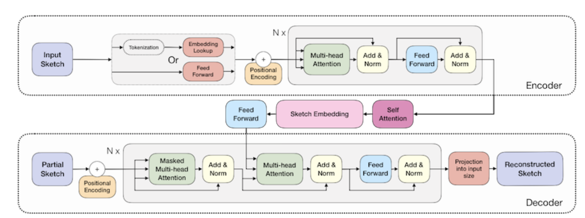

### they add some parts to original transformer (with dotted lines)

1. tokenization before input embedding
2. self-attention and sketch embedding on output of encoder

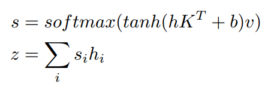

3. change how masking worked on the decoder, to force our transformer to learn reconstruction without previously knowing the sequence length and using only the embedding representation

### Loss

- classification loss

  connect to z

- reconstruction loss

  1. if input is continuous then L2 loss and a 3-way  classification term
  2. otherwise use softmax to regularize a dictionary of sketch tokens

## Other Methods

### About Model

- simplify all sketches using the RDP algorithm and normalize stroke length.

- dictionary learning

  1. build a dictionary of K code words. **this may decrease the difficulty of network.**
  2. cluster via K-means for 100k sketch pen movements.
  3. each transition point (δx, δy) is then assigned to the nearest code
     word.

- spatial grid

  each grid has a different token

### Cross-model search embedding (between sketch and image)

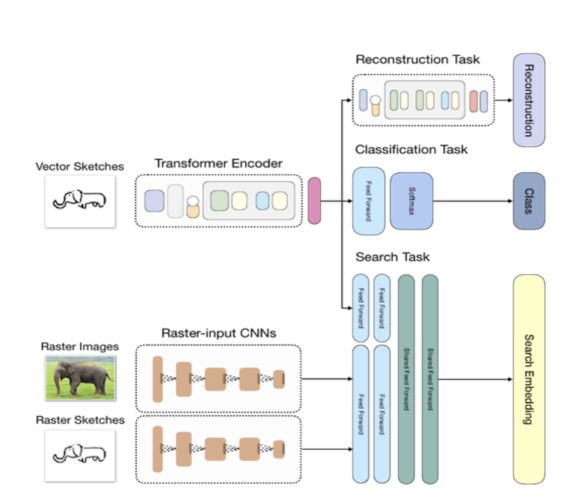

## Experiment

- classification

  We explore this further by shuffling the order of the sketch strokes retraining the transformer models from scratch. We were surprised to see comparable performance, suggesting this gain is due to spatial continuity rather than temporal information.

  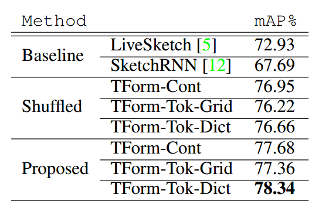

  **345-way classifier**

- retrieval

  1. stability

     add noise to two models to see the retrieval results

  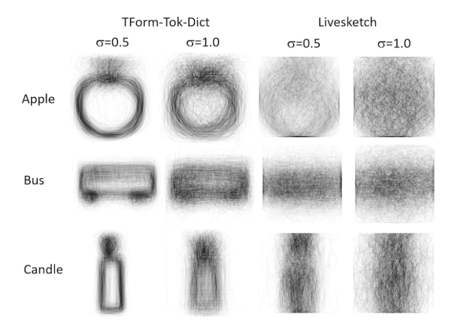

  2. interpolation

  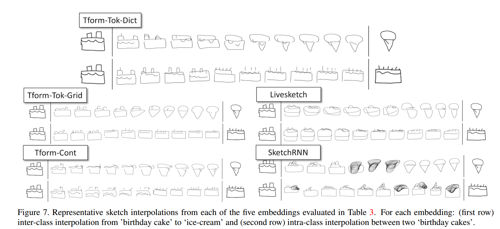

- sketch2sketch matching (S-S)

  among 345 categories

  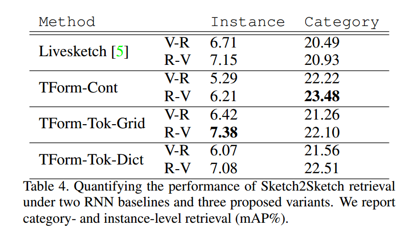

- sketch2image matching (SBIR)

  among 345 categories

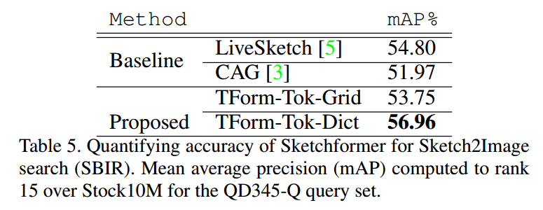

## Q

- does the dictionary learning increase the grain size?
- 

## Idea

- The so-called temporal information should be structrue of partial strokes instead of order of points or strokes.

# Sketch-BERT: Learning Sketch Bidirectional Encoder Representation from Transformers by Self-supervised Learning of Sketch Gestalt

## Main Task and Contribution

We generalize BERT to sketch domain, with the novel proposed components and pre-training algorithms, including the newly designed sketch embedding networks, and the self-supervised learning of sketch gestalt. 

Experimentally, we show that the learned representation of Sketch-BERT can help and improve the performance of the downstream tasks of sketch recognition, sketch retrieval, and sketch gestalt.

The BERT model is extended to sketches.

A novel task – sketch Gestalt (sGesta) is for the first time studied in this paper.

A selfsupervised learning process by sketch gestalt, is presented.

## Model Architecture

### Embedding

- point embedding

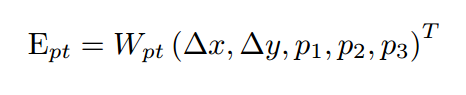

- positional embedding

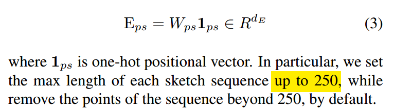

- stroke embedding

  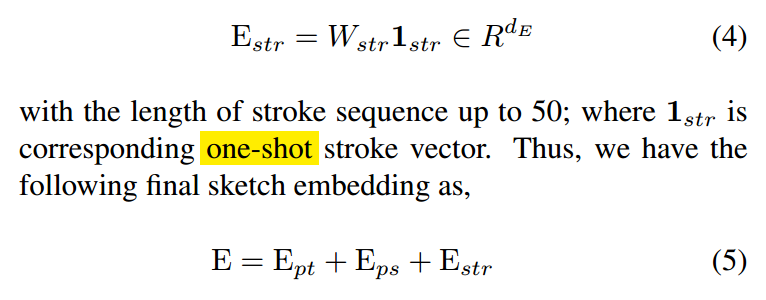

- input after final embedding 

  embedding of a sketch

  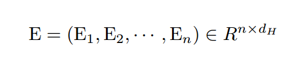

### Structure

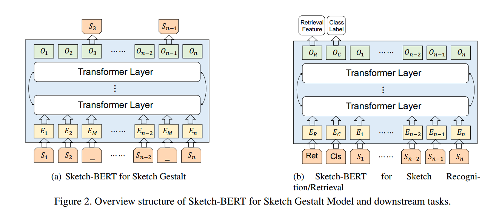

## Other Methods

### Gestalt of Sketch and Self-supervised Learning

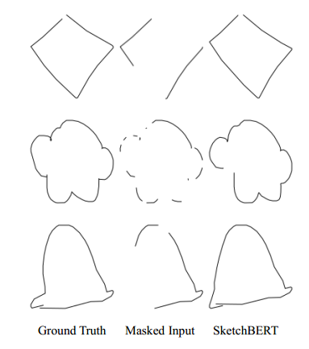

Mask 15% for training

### Pre-training Task Analysis

- mask different part

  (1) Single, means the traditional random mask strategy used in BERT; (2)Position, means that only masks the position information according
  to the mask strategy in our sketch gestalt model; (3)State, masks the state information, (4) Full, is the full newly proposed mask strategy in sketch gestalt model. 

  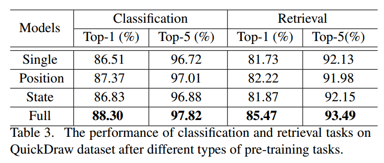

  Furthermore, we can find the position information plays a more important role to sketch representation learning than the state information.

## Experiment

- recognition

   100 categories with 5K train samples, 2.5K validation samples and 2.5K test samples for QuickDraw dataset; whole categories of TUBerlin dataset with training split of 80%=10%=10% for train/validation/test samples, respectively.

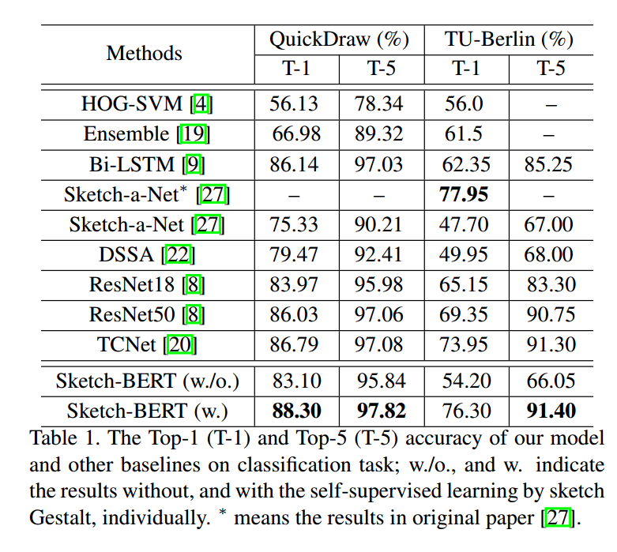

- retrieval

  category-level and same dataset with recognition

  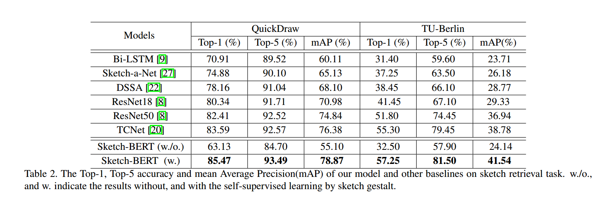

## Idea

- compare high-dimension feature vectors among different sketch models or different specific tasks, maybe we would find sth interesting? 

# Sketch-R2CNN: An Attentive Network for Vector Sketch Recognition

## Basic information

- JOURNAL: IEEE transactions on visualization and computer graphics
- YEAR: 2020

## Contribution

Give a novel single-branch attentive network and then use cnn to extract features from attentive map. RNN and attention design is used to draw attention map and CNN is used to capture features with the help of RNN.   

## Model Architecture

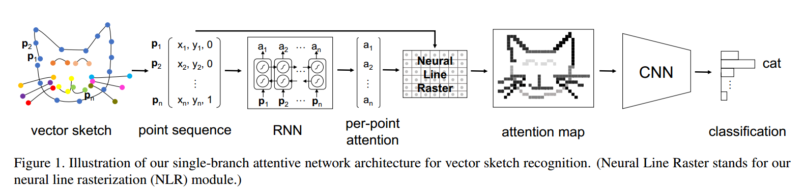

- point representation: (x, y, s), s is a binary stroke state, 1 or 0.

- NLR module: per-point attention + points -> raster image.

  1. decide whether pixel need to be drawn.  

  

  2. decide grid value of pixel.

     

     

## Experiment

  ### Results on TU-Berlin Benchmark

By inserting one of these CNN alternatives into the proposed architecture, we can study how helpful the attention learned by RNN can be for vector sketch recognition.

Most features of sketch are extracted by CNN variants instead of RNN and attention. 

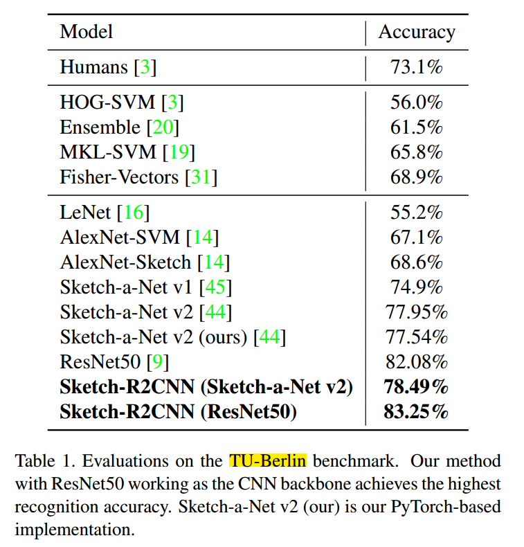

### Alternatives Study on TU-Berlin Benchmark

- To study the influence of temporal ordering information provided by human on RNN’s attention estimation, we trained Sketch-R2CNN (ResNet50) with randomized stroke orders. This scheme, named Random-Stroke Order, achieves a slightly lower recognition accuracy of 82.78% than Sketch-R2CNN (ResNet50) on the TU-Berlin benchmark, still superior to the ResNet 50-only model. 

  With random order, the model accuracy just decrease little percentage, thus I think the so-called order does not make sense.

- we encode its ordering information into an image through rasterization by assigning an intensity value of one to the first point and zero to the last point and linearly interpolating the intensities of the points in-between.

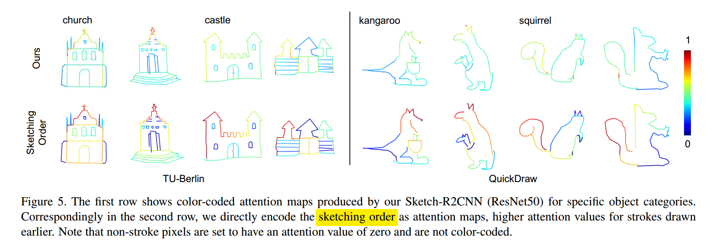

​			This indicates that, for CNN-based recognition networks, stroke importance may not always be properly aligned with stroke order under such a straightforward encoding scheme, due to different drawing styles used by different users, and this encoding scheme may even pose challenges to CNNs for learning effective patterns.

### Limitation

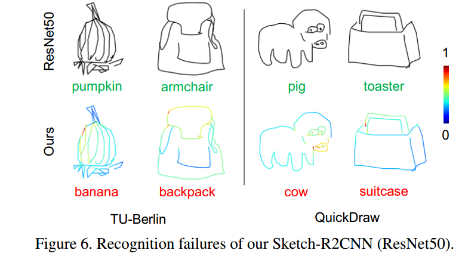

possibly due to the inability in extracting effective sequential features from inputs with similar temporal ordering and grouping cues as other training sketches in different categories.

## Idea

- recognition procedure: points -> strokes -> structures
- graphs of different level: an example that one sketch is consisted of more than one graph, then every graph has different weight for sketch recognition. 

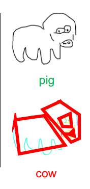

- human temporal information can be useful when the sketch was drawn in a common order. otherwise, temporal information would mislead us. So I think a res-rnn block is needed, rnn try to find the temporal information and an excess FF plays a role when the training sketch is in a noval order.
- use images to display the domain that model pays attention to.

