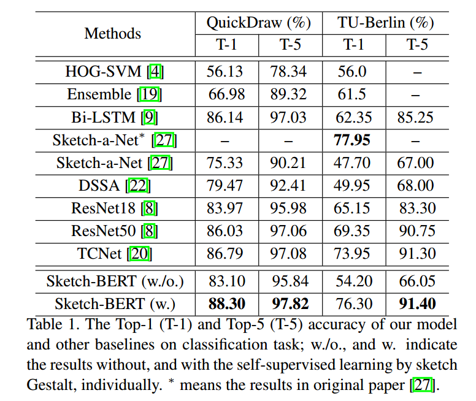
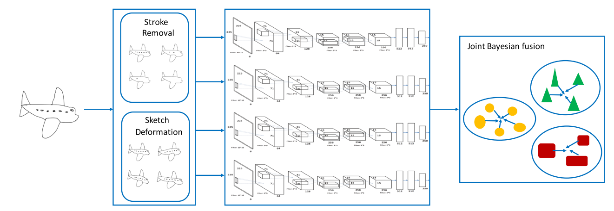
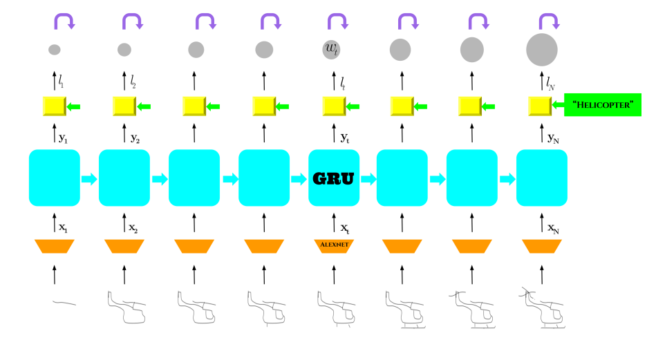
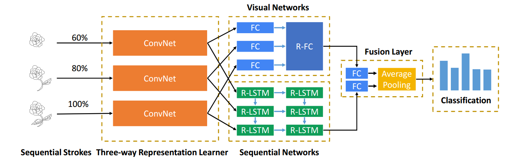
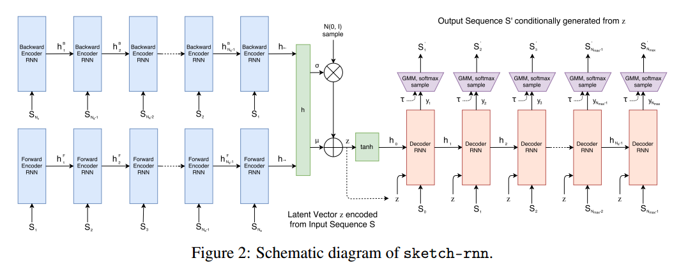
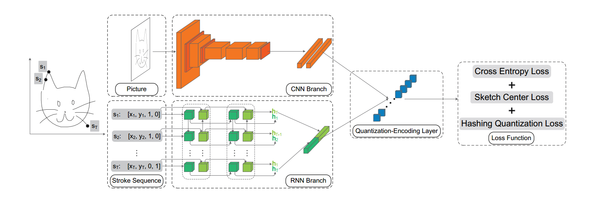
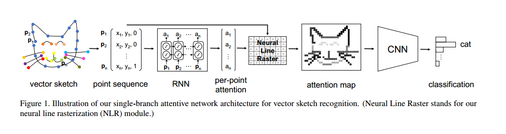
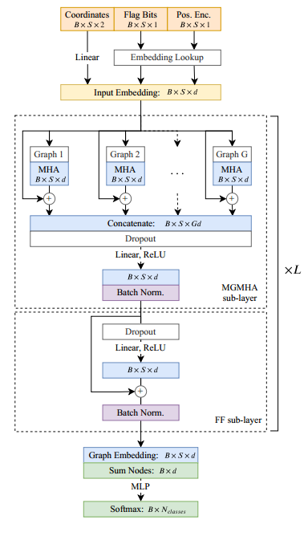
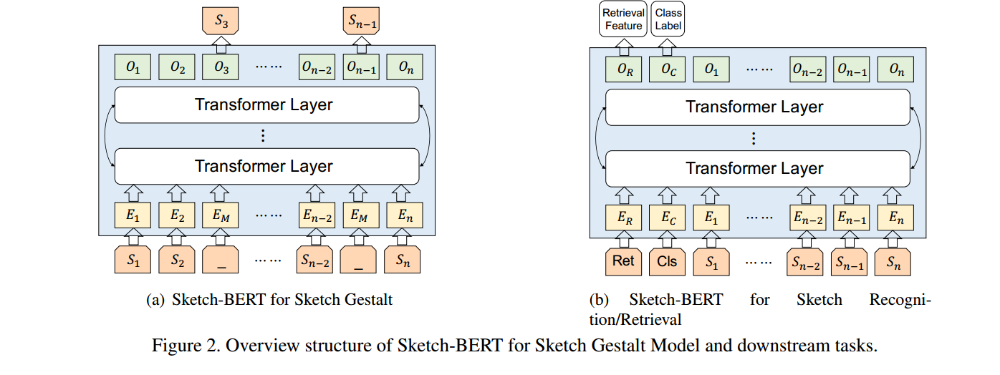
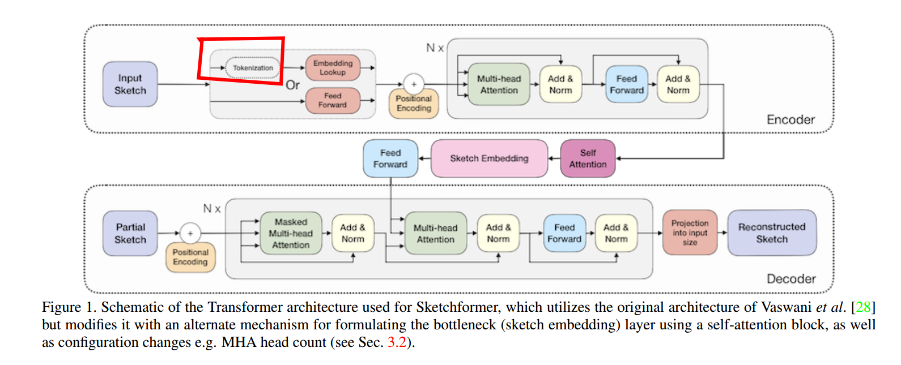

# A Simple Summary

### What

There are many different task in sketch, however, for one dataset, what the models really need is to find a representation(feature) vector which can represent distribution of the whole dataset. Then we can add some module after the feature vector for specific task.

### Methods

- CNN

  1. CNN is very powerful, however,  it can't fit some character of sketch very well.
  2. CNN has arrived a high accuracy.
  3. CNN with unsupervised learning on sketch is still blank.

  

- RNN

  1. temporal points as input maybe make no sense, especially after attention was invented. 

- GNN

  1. learning structural knowledge, combining with self-supervised learning is perfect. 
  2. like human, human can't know the pattern if the points or strokes are random and noisy.

- Transformer&Bert

  1. seq2seq, the sequence is still composed of points, sketch bert has arrive their upper bound.

### Characteristics of Sketch

- no background information
- drawn casually
- vector (temporal points and stroke)
- highly abstract
- highly sparsely

### Idea

- how to embedding sketch? There are image, image&points sequence, points sequence and graph
- how to fix the casualty sketch drawing? how to make model capable of dealing with randomness? add random sample from N(0,1) to some layers?
- recognition and retrieval have been highly studied (especially using RNNs), maybe it's time to translate application direction.
- graph, self-supervision, serve sketch as image and create a new extractor (like convolution filter as common images)
- reference other strategies of deep learning (unsupervised, transfer learning ...)
- is there 3d-graph alive? (laugh)