# Unsupervised Sketch to Photo Synthesis

## Publish

oral of ECCV 2020

## Contribution

To summarize, our work makes the following major contributions. 

1) We propose the first two-stage unsupervised model that can generate diverse, sketchfaithful, and photo-realistic images from a single free-hand sketch. 

2) We introduce a self-supervised learning objective and an attention module to handle abstraction and style variations in sketches. 

3) Our work not only enables sketch-based image retrieval but also delivers an automatic sketcher that captures human visual perception beyond the edge map of a photo.  

## Model Architecture

### Shape Translation

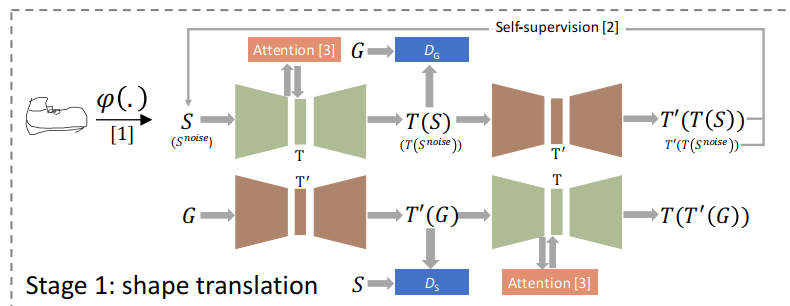

- Self-supervised objective  

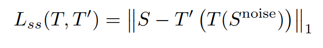

It makes the model ignore irrelevant strokes and put more efforts on style-invariant strokes in the sketch .

- Total objective

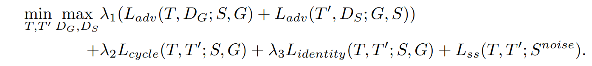

- Ignore distractions with active attention

  Our attention is used for area suppression instead of the usual area highlight.  That is, the attention module generates an attention map A to be used for re-weighting the feature representation of sketch S (Eq.

  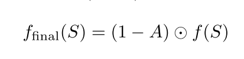

### Content Enhancement (A single GAN)

We thus model the task as a style transfer task and use an optional reference color image to guide the selection of a particular style.

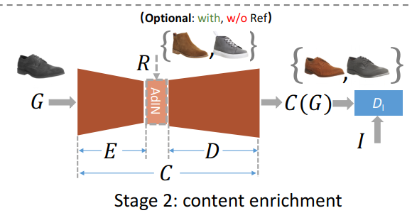

- idensity loss

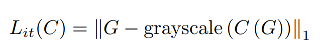

We thus model the task as a style transfer task and use an optional reference color image to guide the selection of a particular style. Therefore we use a self-supervised intensity loss.   

- adversarial loss

- content and style loss (optional)

  We follow AdaIN [14] to inject style information by adjusting the feature map statistics. Specifically, the encoder E takes the input grayscale image G and generates a feature map x = E(G), then the mean and variance of x are adjusted by the reference’s feature map xref = E(R). The new feature map is xnew = AdaIN(x, xref) (Eq.4)

  The content loss (Eq. 5) is used to guarantee that the input and output images are consistent perceptually, whereas the style loss (Eq. 6) is to ensure the style of the output is aligned with that of the reference image.

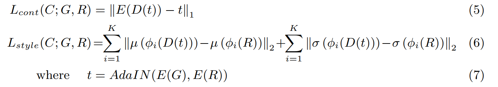

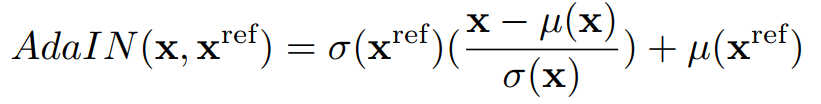

- total loss for content enhancement

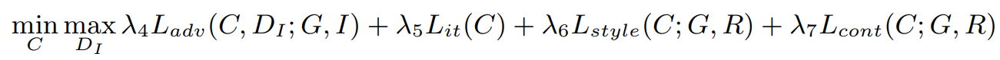

## Special Methods

### two strategies   

we introduce two strategies for the model to extract style-invariant information only: 

1) We compose additional noise sketches  to enrich the dataset and introduce a self-supervised objective; 

2) We introduce an attention module to help detect distracting regions.

## Experiments

### Evaluation metrics

1) Fr´echet Inception Distance (FID) - the distance between synthesized and real samples according inception-v3

2) User study (Quality) - evaluates subjective impressions in terms of similarity and realism

3) Learned perceptual image patch similarity (LPIPS) - measures the distance between two images. As in [15,38], we use it to evaluate the diversity of synthesized photos.

## Comment 

### Question they raise

**Existing methods fail in sketch to photo synthesis when both shape and color translations are needed simultaneously.**

1) Most image synthesis that deals with shape transfiguration tends to stay in the same visual domain. (only in sketch domain)

2) Edge maps are most studied, an edge map based drawing to photo synthesis task does not have the spatial deformation problem between sketches and photos. (color but no edge) (sketch is more flexible than edge map)

### Question sovled?

- All the models perform poorly on ChairV2, probably due to more shape variations but far fewer training data for chairs than for shoes (1:5). And there is still some space to improve.

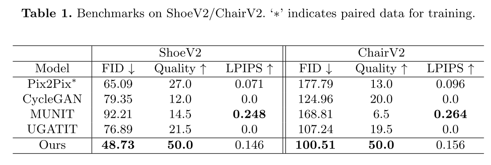

- sketch based image retrieval: achieve an accuracy of 37.2%(65.2%) at top5 (top20) respectively. 

### Limitation of Method

- Their Synthesis base on two collections of one class (e.g. shoe dataset) and can not be apply to all classes. 
- Their representation of sketch is same as that of image rather than specific structure with sketch. (change the representation of sketch, use sketch-bert for example)
- De-noising attention maybe could be replaced by sketch simpifiy module. the origin module may lose some information.
- sketches in this paper are more regular than those in google sketch dataset, however, I think they are more close to common people.       *(Compared to QuickDraw [11], Sketchy [28], and TU-Berlin [6], sketches in ShoeV2/ChairV2 have more fine-grained details. They demand like-kind details in synthesized photos and are thus more challenging as a testbed for sketch to photo synthesis.)*

## Creation

### Good Idea

- two-stage
- self-supervision to avoid the influence of noise
- attention to reweight 

### Other Idea

### New things I want to do

## Questions

- We consider unpaired sketch and photo images, not only because paired data are scarce and hard to collect, but also because heavy reliance on paired data could restrict the model from recognizing the inherent misalignment between sketches and photos.  
- where is the attention map from?
- does cycle loss conflict with self-supervision loss?
- what does identity loss in shape translation really mean? (really make sense?)
- does sketch2sketch exist?
- why use this attention module?

## Idea

- 3-stage: sketch -> edge -> greyscale -> image
- evaluation metrix is numeric, a new evaluation method: randomly given painter 50 photos in a short period, then ask the painter to draw sketch, then our model give the prediction result to painter, the painter judge whether the result is what he wants.  
- change the representation of sketch (in encoder of generator), use sketch-bert for example
- pre-train model of different stages and then combine them to fine-tune.
- use the way used in deepfacedrawing (do something to encoded vector ) to add other information like text information 

# DeepFaceDrawing: Deep Generation of Face Images from Sketches

## Contribution

Model uses input sketches as soft constraints and is thus able to produce high-quality face images even from rough and/or incomplete sketches.

## Good Idea

uses input sketches as soft constraints rather than hard constraints.

## Comment

### Question they raise

Research before require sketches with quality similar to edge maps of real images to synthesize realistic face images. However, such sketches are difficult to make especially for users with little training in drawing.

our key idea is to implicitly learn a space of plausible face sketches from real face sketch images and find the closest point in this space to approximate an input sketch. In this way, sketches can be used more like soft constraints to guide image synthesis.

### Assume

Learning such a space globally (if exists) is not very feasible due to the limited training data against an expected high- dimensional feature space., so they assume each component manifold is low-dimensional and locally linear.

## Model Architecture

### CE

we assume that the underlying component manifolds are locally linear. We then follow the main idea of the classic locally linear embedding (LLE) algorithm.

first learn the feature embeddings of face components. encode five components to 5 512 dimensions vector and then use decoder to reconstruct sketch components. training this auto encoder with self-supervision methods using mse loss can make feature vector representing sketch details better.

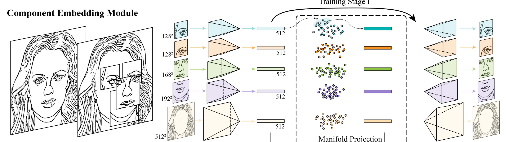

### FM

design the FM module with five separate decoding models converting feature vectors to spatial feature maps. For each feature map, it has 32 channels and is of the same spatial size as the corresponding component in the sketch domain. we use a fixed depth order (i.e., “left/right eyes" > “nose" > “mouth” > “remainder") to merge the feature maps.

This step turns component sketches into semantically meaningful feature vectors.

Since sketches only have one channel, the incompatibility of neigh- boring components in the overlapping regions is thus difficult to automatically resolve by sketch-to-image networks. This motivates us to map the feature vectors of sampled manifold points to multi- channel feature maps (i.e., 3D feature tensors).

FM turns the component feature vectors to the corresponding feature maps to improve the information flow. The feature maps of individual face components are then combined according to the face structure and finally passed to IS for face image synthesis.

### IS

IS module converts them to a realistic face image. We implement this module using a conditional GAN architecture, which takes the feature maps as input to a generator.

the discriminator is designed to determine the samples in a multi-scale manner: we downsample the input to multiple sizes and use multiple discriminators to process different inputs at different scales. We use this setting to learn the high-level correlations among parts implicitly.

### Manifold Projection

first find the K (here is 10) nearest samples in feature space under the Euclidean space. then seek a linear com- bination of these neighbors to reconstruct the feature vector by minimizing the reconstruction error. w* mean weights, left f* mean the real input vector of a component c and right f* mean feature vectors from its nearest neighborhood. 

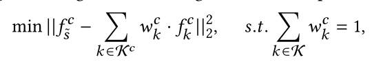

### Shadow-guided Sketching Interface

provide a slider for each component type to control the blending weights between a sketched component and its refined version after manifold projection.

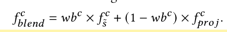

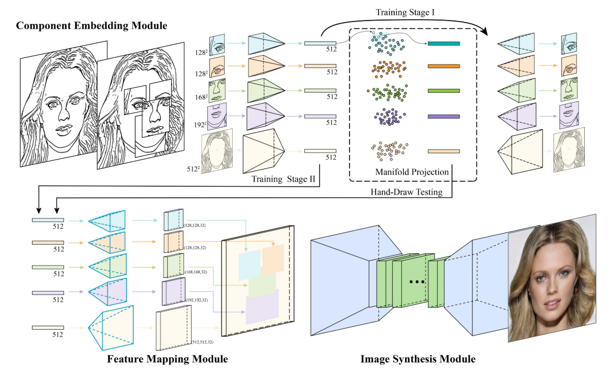

### Data Preparation

We thus adopt this approach (i.e., Photocopy + sketch simplification) to prepare our training dataset, which contains 17K pairs of sketch- image pairs (see an example pair in Figure 2 (f) and (a)), with 6247 for male subjects and 11456 for female subjects.

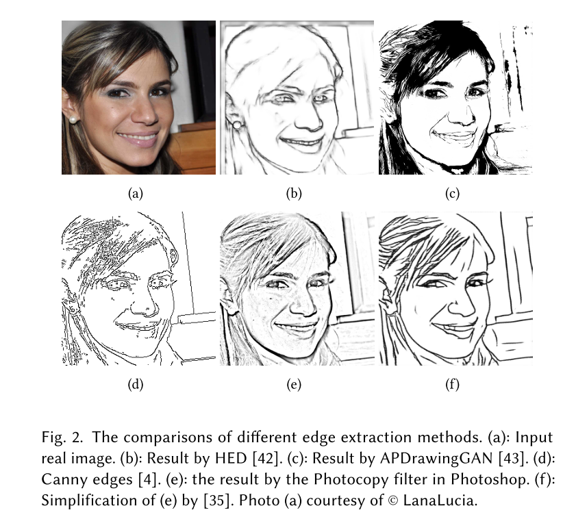

### Two-stage Training

- CE module is trained first in a self- supervised manner, with the mean square error (MSE) loss between an input sketch image and the reconstructed image.
- In Stage II, we fix the parameters of the trained component encoders and train the entire network with the unknown parameters in the FM and IS modules together in an end-to-end manner. For the GAN in the IS, besides the GAN loss, we also incorporate a L1 loss to further guide the generator and thus ensure the pixel-wise quality of generated images. We use the perceptual loss [21] in the discriminator to com- pare the high-level difference between real and generated images.

## Experiments

- Usability Study

- **Comparison with Alternative Refinement Strategies**

  1. **component-level retrieval-and-interpolation**
  2. **locally, use top- 1 instead of top-K for manifold projection**
  3. **globally, replace the CE module with a new module for the feature embeddings of entire face sketches**

  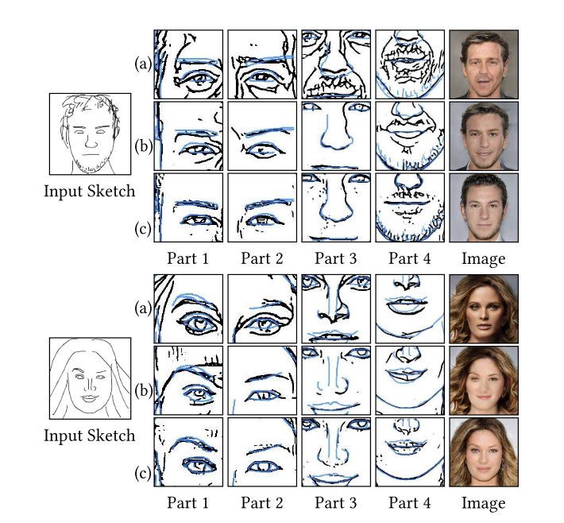

- Perceptive Evaluation Study

- Comparison with Existing Solutions

## Questions

- Why do they divide human face into component before embedding?

## Idea

- make position of face component learnable rather than fixed.

# Image Generation from Sketch Constraint Using Contextual GAN

## Publish

post ? of ECCV 2018 

## Contribution

search for an encoding of the provided corrupted image using only the sketch to provide the weak context for “completing” the image based on a modified objective. This encoding is then used to reconstruct the image by feeding it to the generator which generates the photographic object from sketch. Even for a poorly drawn sketch, they can generate visually comfortable images.

sometimes the free-hand sketch and its natural photographic object do not strictly align to each other. conditional GAN (e.g., pix2pix [9]) is incapable of generating realistic and visually comfortable images.

the corrupted part of an input image is completed using surround- ing image content as context.

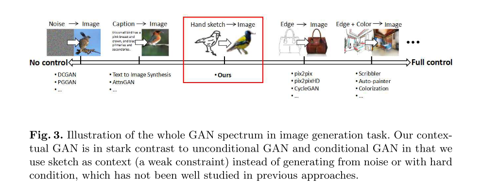

## Method

we spatially concatenate them into a joint sketch-image pair (AB), The generator embeds the joint images onto a non- linear joint space z, i.e., z is a joint embedding of sketch and image.

### Architecture

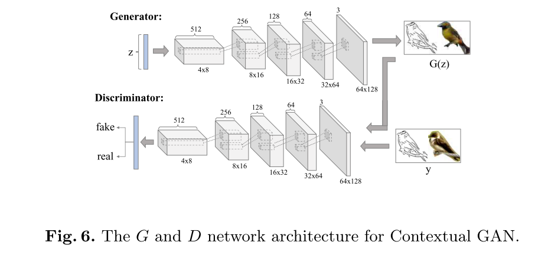

### Objective Function

- Contextual Loss

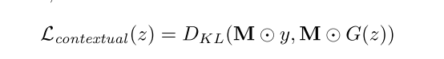

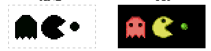

​			since a sketch is a binary image rather than a natural image, we use the KL-divergence to measure the similarity between the distribution of two sketches which tends to produce better alignment of sketches.  y is input sketch.

- Perceptual loss

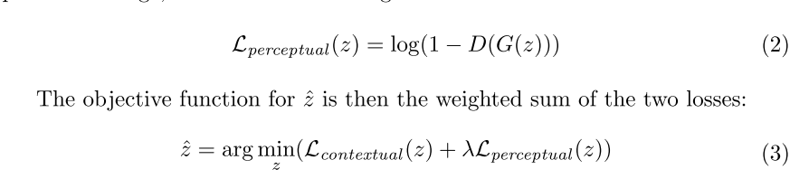

### Contextual GAN

contextual GAN consists of the training stage and completion stage. The training stage is the same as the traditional GAN training except that our train- ing samples are joint images. After training, we learn a generative network G that achieves the objective of reproducing the joint image data distribution.

After training stage:

- Projection through Back Propagation

  *Instead of maximizing D(y), we compute the ˆz vector that minimizes our objective function in Eq. (3). This means that we are projecting the corrupted input onto the z space of the generator through the iterative back propagation. Specifically, the input is a vector z initialized with uniformly random noise, and a joint image with only the sketch on the left with the image on the right being masked out. We back propagate the loss in Eq. (3) to update the randomly sampled input z of network G. Note that in this stage only the input vector z is updated using gradient descent, the weights of the network G and D remain unchanged.*

  Use backpropagation to adjust vector z.

  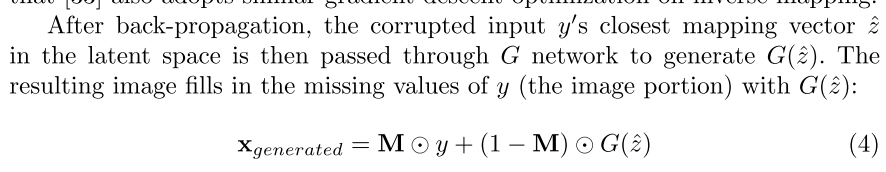

## Their idea

think sketch as context of image to learn the map.

