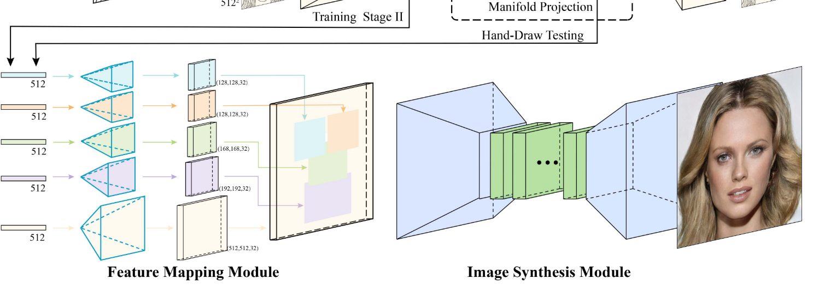

# Unsupervised Sketch to Photo Synthesis

## Publish

oral of ECCV 2020

## Contribution

To summarize, our work makes the following major contributions. 

1) We propose the first two-stage unsupervised model that can generate diverse, sketchfaithful, and photo-realistic images from a single free-hand sketch. 

2) We introduce a self-supervised learning objective and an attention module to handle abstraction and style variations in sketches. 

3) Our work not only enables sketch-based image retrieval but also delivers an automatic sketcher that captures human visual perception beyond the edge map of a photo.  

## Ask Myself

### Question they raise

**Existing methods fail in sketch to photo synthesis when both shape and color translations are needed simultaneously.**

1) Most image synthesis that deals with shape transfiguration tends to stay in the same visual domain. (only in sketch domain)

2) Edge maps are most studied, an edge map based drawing to photo synthesis task does not have the spatial deformation problem between sketches and photos. (color but no edge) (sketch is more flexible than edge map)

### Question sovled?

- All the models perform poorly on ChairV2, probably due to more shape variations but far fewer training data for chairs than for shoes (1:5).

## Model Architecture

### Shape Translation

- Self-supervised objective  

It makes the model ignore irrelevant strokes and put more efforts on style-invariant strokes in the sketch .

- Total objective

- Ignore distractions with active attention

  Our attention is used for area suppression instead of the usual area highlight.  That is, the attention module generates an attention map A to be used for re-weighting the feature representation of sketch S (Eq.

  

### Content Enhancement (A single GAN)

We thus model the task as a style transfer task and use an optional reference color image to guide the selection of a particular style.

- idensity loss

We thus model the task as a style transfer task and use an optional reference color image to guide the selection of a particular style. Therefore we use a self-supervised intensity loss.   

- adversarial loss

- content and style loss (optional)

  We follow AdaIN [14] to inject style information by adjusting the feature map statistics. Specifically, the encoder E takes the input grayscale image G and generates a feature map x = E(G), then the mean and variance of x are adjusted by the reference’s feature map xref = E(R). The new feature map is xnew = AdaIN(x, xref) (Eq.4)

  The content loss (Eq. 5) is used to guarantee that the input and output images are consistent perceptually, whereas the style loss (Eq. 6) is to ensure the style of the output is aligned with that of the reference image.

- total loss for content enhancement

## Special Methods

### two strategies   

we introduce two strategies for the model to extract style-invariant information only: 

1) We compose additional noise sketches  to enrich the dataset and introduce a self-supervised objective; 

2) We introduce an attention module to help detect distracting regions.

## Experiments

### Evaluation metrics

1) Fr´echet Inception Distance (FID)

2) User study (Quality).

3) Learned perceptual image patch similarity (LPIPS)

## Questions

- We consider unpaired sketch and photo images, not only because paired data are scarce and hard to collect, but also because heavy reliance on paired data could restrict the model from recognizing the inherent misalignment between sketches and photos.  
- where is the attention map from?
- does cycle loss conflict with self-supervision loss?
- what does identity loss in shape translation really mean? (really make sense?)
- does sketch2sketch exist?

## Limitation

- Their Synthesis base on two collections of one class (e.g. shoe dataset)
- Their representation of sketch is same as that of image.

## Idea

- 3 steps: sketch -> edge -> greyscale -> image
- evaluation metrix is numeric, a new evaluation method: randomly given painter 50 photos in a short period, then ask the painter to draw sketch, then our model give the prediction result to painter, the painter judge whether the result is what he wants.  

# DeepFaceDrawing: Deep Generation of Face Images from Sketches

## Model Architecture

### CE

first learn the feature embeddings of face components. encode five components to 5 512 dimensions vector and then use decoder to reconstruct sketch components. training this auto encoder with self-supervision methods using mse loss can make feature vector representing sketch details better.

### FM

design the FM module with five separate decoding models converting feature vectors to spatial feature maps. For each feature map, it has 32 channels and is of the same spatial size as the corresponding component in the sketch domain. we use a fixed depth order (i.e., “left/right eyes" > “nose" > “mouth” > “remainder") to merge the feature maps.

This step turns component sketches into semantically meaningful feature vectors.

FM turns the component feature vectors to the corresponding feature maps to improve the information flow. The feature maps of individual face components are then combined according to the face structure and finally passed to IS for face image synthesis.

### IS

IS module converts them to a realistic face image. We implement this module using a conditional GAN architecture, which takes the feature maps as input to a generator.

the discriminator is designed to determine the samples in a multi-scale manner: we downsample the input to multiple sizes and use multiple discriminators to process different inputs at different scales. We use this setting to learn the high-level correlations among parts implicitly.

### Manifold Projection

first find the K (here is 10) nearest samples in feature space under the Euclidean space. then seek a linear com- bination of these neighbors to reconstruct the feature vector by minimizing the reconstruction error. w* mean weights, left f* mean the real input vector of a component c and right f* mean feature vectors from its nearest neighborhood. 

### Shadow-guided Sketching Interface

provide a slider for each component type to control the blending weights between a sketched component and its refined version after manifold projection.

### Data Preparation

We thus adopt this approach (i.e., Photocopy + sketch simplification) to prepare our training dataset, which contains 17K pairs of sketch- image pairs (see an example pair in Figure 2 (f) and (a)), with 6247 for male subjects and 11456 for female subjects.

### Two-stage Training

- CE module is trained first in a self- supervised manner, with the mean square error (MSE) loss between an input sketch image and the reconstructed image.
- In Stage II, we fix the parameters of the trained component encoders and train the entire network with the unknown parameters in the FM and IS modules together in an end-to-end manner. For the GAN in the IS, besides the GAN loss, we also incorporate a L1 loss to further guide the generator and thus ensure the pixel-wise quality of generated images. We use the perceptual loss [21] in the discriminator to com- pare the high-level difference between real and generated images.

## Experiments

## Questions

- Why do they divide human face into component before embedding?